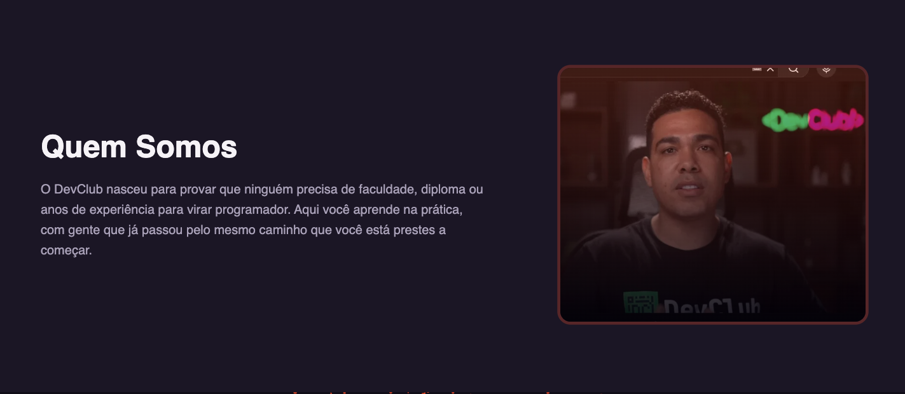
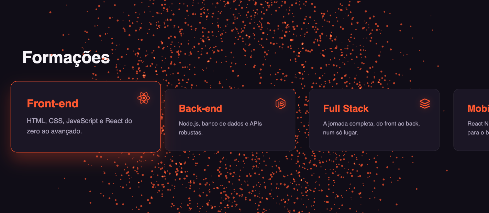
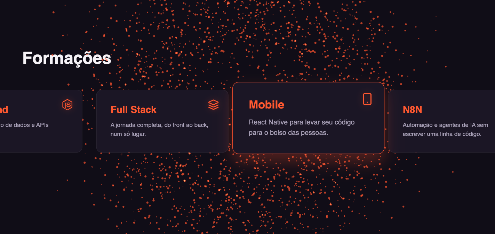
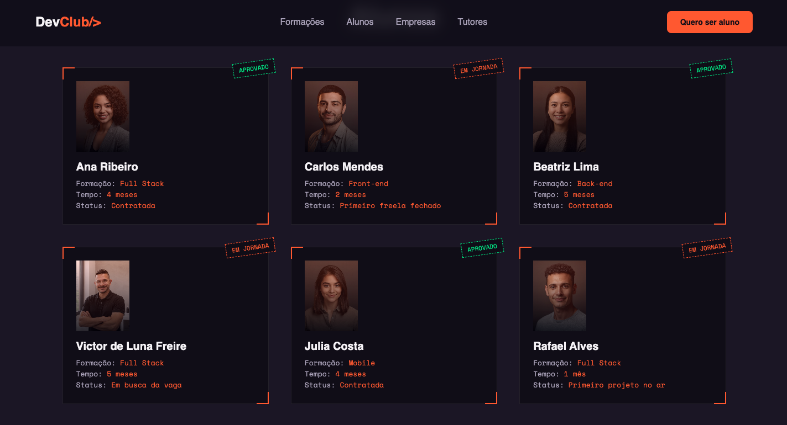
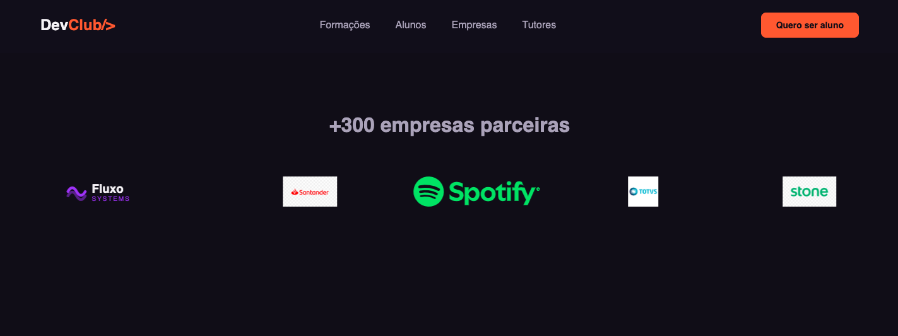
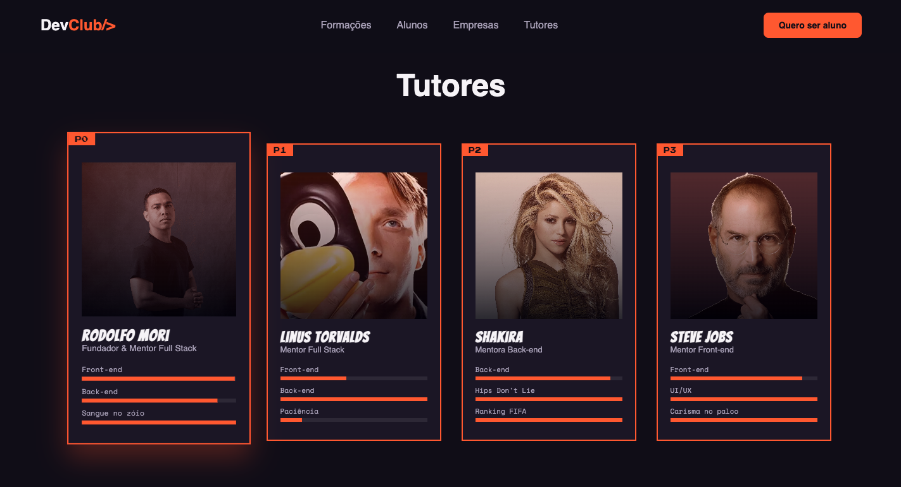
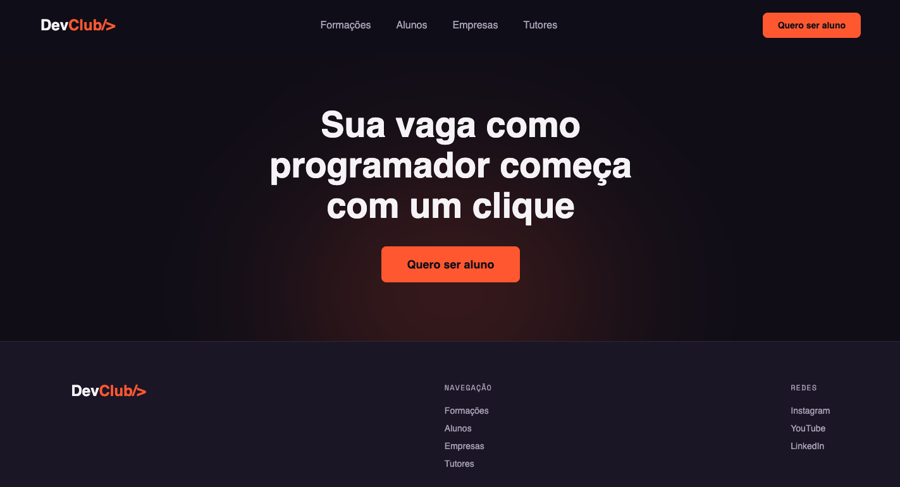

# DevClub — Página Institucional

Página institucional criada para o concurso de vaga de Programador(a) Full Stack do DevClub, proposto por Rodolfo Mori. O desafio: construir uma página disruptiva que apresente a marca, as formações, os alunos, os parceiros e os tutores — com liberdade total de dados e tecnologia.

🔗 **Página publicada:** [devclub-page.vercel.app](https://devclub-page.vercel.app)
🔗 **Repositório:** este mesmo repositório

---

## Sobre o projeto

O conceito visual combina uma estética dark com glow em coral/laranja — pensada para ser marcante como a identidade do DevClub, mas acolhedora o suficiente para não intimidar quem está começando do zero na programação. A página mistura storytelling (a jornada de quem entrou sem saber nada) com prova social gamificada (fichas de RPG para alunos, seleção de personagem estilo fighting game para tutores).

## Stack técnica

- **React + Vite**
- **Styled Components** — estilização e temas
- **GSAP + ScrollTrigger** — animações de entrada e scroll horizontal pinado
- **Swiper** — carrossel de formações (versão inicial)
- **Canvas API** — sistema de partículas ambiente (fundo animado da seção Formações)
- **react-icons** — ícones de tecnologia
- **Biome** — lint e formatação

## Como rodar localmente

```bash
git clone <url-do-repositorio>
cd devclub-page
yarn install
yarn dev
```

Acesse `http://localhost:5173`.

---

## Screenshots

### Hero


### Quem Somos


### Formações
Scroll horizontal pinado via GSAP ScrollTrigger — a seção prende a tela enquanto os cards deslizam lateralmente.




### Alunos


### Empresas Parceiras


### Tutores


### CTA Final e Footer


---

## Decisões técnicas

- **Idioma:** código (variáveis, componentes, commits) em inglês; conteúdo visível ao usuário em português.
- **Estilo de props:** props transientes prefixadas com `$` (padrão Styled Components) para evitar vazamento de atributos não-HTML para o DOM.
- **Responsividade:** testada e ajustada para viewport mobile (390px), incluindo menu hambúrguer no header, grids reempilhados e scroll horizontal adaptado para touch no mobile (sem pin/scrub, que é instável em dispositivos touch).

## Autor

Victor de Luna Freire
[LinkedIn](www.linkedin.com/in/victordelunafreire) · [GitHub](https://github.com/victordelunafreire-rgb)