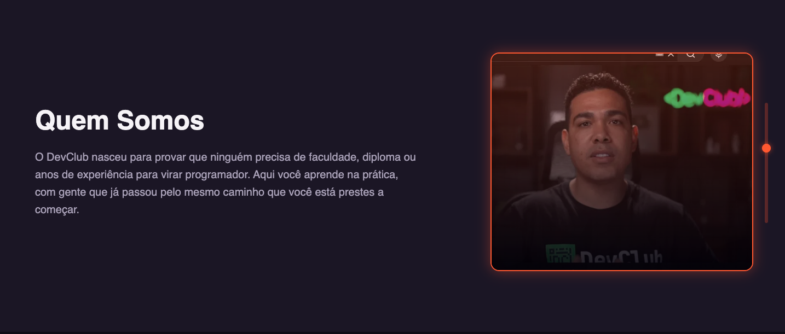
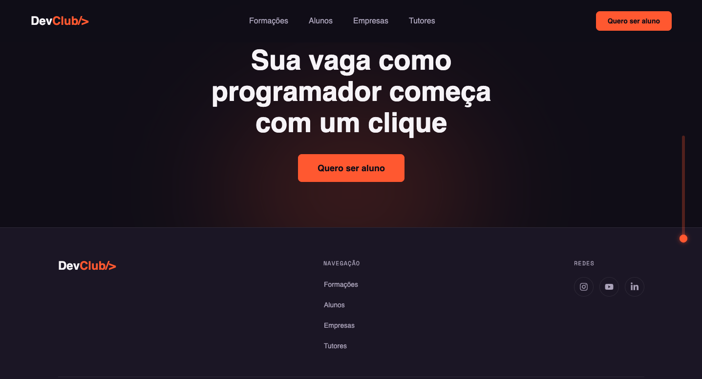

# DevClub — Página Institucional (V2)

Projeto desenvolvido como submissão para a vaga de Programador Full Stack no DevClub, avaliado por Rodolfo Mori. Esta é a segunda versão (V2), reformulada com animações mais avançadas após feedback sobre a primeira submissão.

🔗 **[Ver ao vivo](https://devclub-page.vercel.app/)**

---

## Versões

- **V2 (atual, em produção)** — branch `main`: versão reformulada com frame-scroll no Hero, transição controlada no About, progressão de cards no Formations, e demais animações avançadas descritas no `CLAUDE.md`.
- **V1 (submissão original)** — [branch `v1`](https://github.com/victordelunafreire-rgb/devclub-page/tree/v1) / [tag `v1.0-submission`](https://github.com/victordelunafreire-rgb/devclub-page/releases/tag/v1.0-submission): primeira versão entregue, mantida para referência histórica.

---

## Stack técnica

- **React** + **Vite**
- **Styled Components** — estilização
- **GSAP** + **ScrollTrigger** — animações e efeitos de scroll
- **Biome** — lint e formatação
- **Yarn** — gerenciador de pacotes

---

## Como rodar localmente

```bash
yarn install
yarn dev
```

---

## Seções do projeto

Cada seção abaixo tem um vídeo curto demonstrando os efeitos, sem necessidade de rodar o projeto localmente.


### Hero (abertura)
<video src="src/assets/README/devclub-intro.mov" controls width="600"></video>

### Quem Somos


### Formações
<video src="src/assets/README/devclub_formations.mov" controls width="600"></video>

### Alunos
<video src="src/assets/README/devclub_students.mov" controls width="600"></video>

### Empresas Parceiras
<video src="src/assets/README/devclub_partners.mov" controls width="600"></video>

### Tutores
<video src="src/assets/README/devclub_tutors.mov" controls width="600"></video>

### CTA + Footer


---

## Pipeline de mídia gerada por IA

A sequência de abertura do Hero (imagem-âncora + vídeo animado, técnica de frame-scroll) foi produzida com um pipeline próprio:

1. **Geração de imagem** — Gemini (Nano Banana)
2. **Geração de vídeo** — Gemini (Veo), a partir da imagem-âncora
3. **Pós-processamento** — remoção de marca d'água via inpainting (Python/OpenCV) e fatiamento em frames com **FFmpeg**
4. **Integração** — frames sincronizados ao scroll via GSAP ScrollTrigger, renderizados em `<canvas>`

---

## Referências visuais e de efeito

- [landonorris.com](https://landonorris.com)
- [mbadevclub.com.br](https://mbadevclub.com.br)
- [cinetica.studio](https://cinetica.studio)
- [otsuka-air.jp](https://otsuka-air.jp)

---

## Desenvolvimento

Construído em parceria com **Claude Code** (Anthropic) para a implementação técnica, com direção de arte, decisões de produto e validação de cada etapa por Victor de Luna Freire.

---

## Contato

- LinkedIn: [victordelunafreire](www.linkedin.com/in/victordelunafreire)
- GitHub: [@victordelunafreire-rgb](www.github.com/victordelunafreire-rgb)